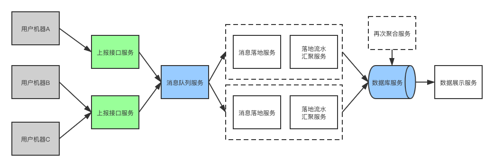

# GameReport

小游戏上报的示例

## 设计要点

1. 考虑到每天百万uv 即保守估计 最大并发20

```
千万上报接口请求/天 = 最大20次/s
```

2. 日志暂时没有检索需求 不需要查看流水细节

## 整体的流程图



## 模块划分

主要涵盖的模块包括

| 模块名 | 模块功能 | 设计要点 | 计划选型 |
|----|----|----|----|
|上报服务|接收上报的内容, 写入消息队列|水平可扩展 性能可用|openresty+lua|
|消息队列服务|||开源的rabbitmq足够|
|消息落地服务|接收消息, 将日志落盘|如果分布式 则日志会打散到不同的机器上 需要同时部署落地流水汇聚服务+再次聚合服务来聚合多份数据||
|落地流水汇聚服务|读取落地的日志, 汇聚数据并写到数据库|支持处理不同类型的日志 预留一定的可扩展性||
|再次聚合服务|当前两个服务分布式部署的时候 需要这个服务来再次汇聚数据|跟前面的落地流水汇聚服务最好保持类似的处理逻辑 复用||
|数据展示服务|||laravel-admin|

## Demo方案介绍

demo计划支持两种数据的上报

1. 某款小程序每天点击量
2. 某款小程序每天跳转到另外一款小程序的量

生成3种数据的展示

1. 小程序的日点击量表格
2. 小程序日跳转量的总表
3. 小程序日跳转量的明细表

### 业务设计方案

#### 日志格式

```
type: 上报的数据类型(后续根据这个字段来设计解析规则) 例如 页面跳转 用户点击等
dimensions: 维度(根据业务需要扩展)
    objectId: 上报对象id
    toObjectId: 当type=页面跳转时 对应小程序对象的id
metrics: 指标
    count: 1    //触发一次
time: 上报时间
```

上报接口、落盘日志、消息队列都基于该格式

#### 汇聚规则配置

1. type(用户点击) -> toType(用户点击) key(objectId) sum(count) 
2. type(页面跳转) -> toType(页面跳转) key(objectId+toObjectId) sum(count)
3. type(页面跳转) -> toType(页面跳转总数) key(objectId) sum(count)

#### 数据库表

数据库表包括分布的临时汇聚表 以及 最终的结果表\
后期看需要可以按照数据类型分表

```
//临时汇聚表
t_game_report_temp_day
    id
    type
    objectId
    toObjectId
    count
    day

t_game_report_day
    id
    type
    objectId
    toObjectId
    count
    day
```
